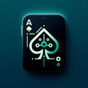

# <div align="center"> Pokerface</div>

<div align="center">Pokerface is an open-source wallpapers app for Android/iOS. It is built with Dart on top of Google's Flutter Framework. It helps one to understand and play Texas Hold'em Poker better.


</div>

<div align="center"></div>

https://github.com/codenameakshay/pokerface-flutter/assets/60510869/463a0294-07e7-41be-8249-526ad4245b91

## Table of Contents

- [About the Project](#about-the-project)
- [Getting Started](#getting-started)
  - [Prerequisites](#prerequisites)
  - [Installation](#installation)
- [Features](#features)
- [Usage](#usage)
- [Contributing](#contributing)
- [Roadmap](#roadmap)
- [License](#license)
- [Contact](#contact)
- [Contributors](#contributors)

## About The Project

Pokerface is a mobile application developed using Flutter, designed to help poker players of all levels improve their game. It offers a range of tools and resources, from hand odds calculation to strategy tips tailored to your playing style. It can find the best hand depending on current hand and board cards, calculate the odds of winning, and suggest the best move to make.

### Built With

- [Flutter](https://flutter.dev/)
- [Dart](https://dart.dev/)

## Getting Started

To get a local copy up and running follow these simple steps.

### Prerequisites

- Flutter: Make sure you have Flutter installed on your machine. To install Flutter, follow the instructions on the [Flutter official website](https://flutter.dev/docs/get-started/install).
- Gemini API: The app uses the Gemini API to use Gemini Pro model inside the app. You will need to create an account on the [Gemini website](https://aistudio.google.com/app/apikey) and generate an API key to use the app.

Paste the API key in the `.env` file in the root of the project.

```.env
GOOGLE_GENERATIVE_AI_KEY=YOUR_API_KEY
```

### Installation

1. Clone the repo

   ```sh
   git clone https://github.com/codenameakshay/pokerface-flutter.git
   ```

2. Navigate to the project directory

   ```sh
   cd pokerface-flutter
   ```

3. Install dependencies

   ```sh
   flutter pub get
   ```

4. Run the app

   ```sh
   flutter run
   ```

## Features

- Hand Calculator: Calculate the best cards with your current hand in real-time.
- AI Assitance: Get suggestions on the best move to make, based on your current hand and the house cards.
- Odds Calculator: Calculate the odds of winning with your current hand and the house cards.
- Strategy Tips: Get tips and tricks to improve your game, tailored to your playing style.
- Themes: Choose from a range of themes to customize the app to your liking.

It also features a lot of easter eggs and cool animations to make the app more fun and engaging.

## Usage

The app is simple to use and intuitive. It is designed to be user-friendly and accessible to players of all levels. The app will guide you through the process of calculating the best hand and making the best move.

## Contributing

Contributions are what make the open-source community such an amazing place to learn, inspire, and create. Any contributions you make are **greatly appreciated**.

1. Fork the Project
2. Create your Feature Branch (`git checkout -b feature/AmazingFeature`)
3. Commit your Changes (`git commit -m 'Add some AmazingFeature'`)
4. Push to the Branch (`git push origin feature/AmazingFeature`)
5. Open a Pull Request

## Roadmap
- [ ] Game timer (to time games)
- [ ] Currently you have to new game for each round, show option to restart when all house cards are selected
- [ ] Save game history
- [ ] Background music + SFX
- [ ] Volume control and settings
- [ ] Badges
- [ ] Achievements
- [ ] Dynamic app icons
- [ ] Calculate score for each game
- [ ] Store win/loss of each game
- [ ] Integrate AI into more features
- [ ] Premium subscription
- [ ] Onboarding

## License

Distributed under the MIT License. See `LICENSE` for more information.

## Contact

Your Name - [@codenameakshay](https://x.com/codenameakshay) - <akshaymaurya3006@gmail.com>

Project Link: [https://github.com/codenameakshay/pokerface-flutter](https://github.com/codenameakshay/pokerface-flutter)

## Contributors

<a href="https://github.com/codenameakshay/pokerface-flutter/graphs/contributors">
  
</a>

## If you made it here, thanks for your support. You can show more support by forking or starring this repo. See ya!
